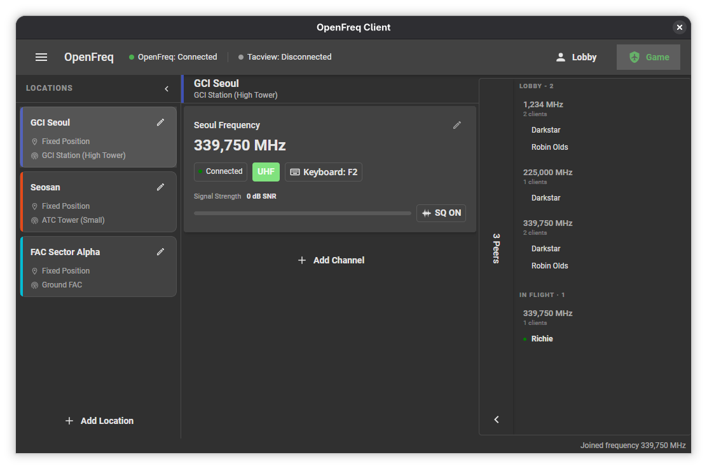
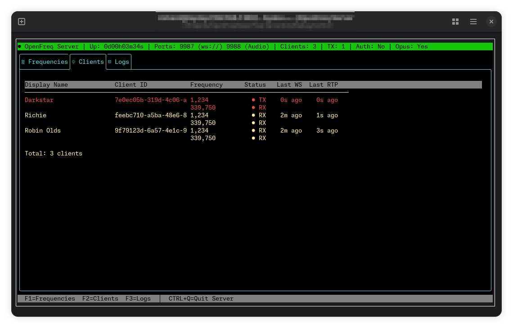

# OpenFreq

Real-time network voice radio with real-time physics simulation for [Falcon BMS](https://www.falcon-bms.com/) and DCS.



## Features
- Seamless integration into Falcon BMS - no extra configuration required
- Realistic radio propagation: signal strength, line-of-sight, Doppler and more (via [OpenFreqAudio](https://github.com/UOAF/OpenFreqAudio))
- Frequency-based voice channels with per-channel PTT and hotkeys (keyboard or joystick)
- [Realistic AM simulation including squelch](https://bitbashing.io/am-radio.html)
- Hot-swappable audio devices
- Dedicated GCI (Ground Controlled Intercept) client mode with unlimited positions & channels
- GCI-only frequency scanner: silently monitor every active frequency server-wide, encrypted or not, without joining each one by hand
- DCS A-10C II mode with DCS Export.lua radio/PTT/position integration
- Optional DCS terrain heightmap generation through `land.getHeight`
- Full 3D audio effects enabled in GCI mode — identical physics simulation as BMS mode
- GCI Position sources: static via map UI picker & address search or live Tacview/ACMI feed
- Transmitter / Receiver performance presets and SFX
- Opus audio compression and modern RTP stack
- Peer list
- Experimental: sidetone (microphone monitoring)
- Server: Native Windows & Linux support
- Client: Native Windows & Linux support (GCI mode only), BMS mode tested in WINE (see the [Handbook](docs/handbook.md "Handbook") for detailed WINE info)


## Quick Start
### BMS Mode
1. Make sure IVC is not running
2. Launch BMS and OpenFreq in any order
3. Check that OpenFreq is set to BMS mode
4. Connect via BMS UI and enter OpenFreq server address in the BMS IVC field. Make sure the IVC checkbox is selected in BMS.

### GCI Mode
*Note: BMS is not required for GCI Mode*

1. Launch OpenFreq Client, set it to GCI Mode
2. Select Theater. Linux: specify Theater heightmap file
3. Enter connection data and Display name, Connect
4. Don't forget to switch to "Game" mode when clients move to 3D

### DCS Mode
*Note: the first DCS pass targets the A-10C II module.*

1. Install the OpenFreq DCS client package, or run:
   ```powershell
   powershell -ExecutionPolicy Bypass -File installer/windows/Install-DcsExport.ps1
   ```
2. Launch OpenFreq Client and set it to DCS mode.
3. Enter the OpenFreq server address, password, and display name, then connect.
4. Start an A-10C II mission. DCS drives the radio channels, cockpit PTT, own-aircraft position, and game/lobby state.

The DCS export is installed under `Saved Games\DCS...\Mods\Services\OpenFreqDCS` and is loaded from `Saved Games\DCS...\Scripts\Export.lua`. Heightmap sampling is disabled by default in `DCS/OpenFreqDCS/Scripts/OpenFreqDCSConfig.lua`; enable it only when you want DCS to generate a raw terrain file for OpenFreq.


### Server
1. Verify ports 9987 (TCP), 9988 (UDP) are open (default configuration)
2. Launch OpenFreq Server (sensible defaults preconfigured)
3. The configuration file is automatically created (``OpenFreq.Server.json``) - adapt and restart if necessary

#### Container (Podman / Docker)

```bash
docker run -d --name openfreq-server \
  -p 9987:9987 -p 9988:9988/udp \
  ghcr.io/uoaf/openfreq-server:latest
```

Available tags: `latest`, `<x.y.z>`, `nightly`. See the [Handbook](docs/handbook.md "Handbook") for configuration details.


## Documentation
See the [Handbook](docs/handbook.md "Handbook") for in-depth usage and configuration.

## Requirements

- **Self-contained builds** — no dependencies, runs as-is
- **Framework-dependent builds** — requires [.NET 10.0 Runtime](https://dotnet.microsoft.com/download/dotnet/10.0)
- **Building from source** — requires [.NET 10.0 SDK](https://dotnet.microsoft.com/download/dotnet/10.0)

## Architecture


| Component | Role |
|---|---|
| `OpenFreq.Server` | Central relay — signaling (WebSocket) + audio (UDP) |
| `OpenFreq.Client` | Avalonia desktop GUI for end users |
| `OpenFreq.Common` | Shared protocol, RTP pipeline, jitter buffer |
| `OpenFreq.Testclient` | Minimal CLI client for testing |

## Build & Run

```bash
# Build all
dotnet build OpenFreq.sln

# Run server
dotnet run --project OpenFreq.Server/OpenFreq.Server.csproj

# Run client
dotnet run --project OpenFreq.Client/OpenFreq.Client.csproj

# Publish Windows DCS client/server packages
powershell -ExecutionPolicy Bypass -File build/Publish-Client.ps1 -Installer
powershell -ExecutionPolicy Bypass -File build/Publish-Server.ps1 -Installer
```

### Windows DCS Dev Loop

Use the source-run script when iterating on DCS integration so you do not need a
new packaged `.exe` for every test:

```powershell
powershell -ExecutionPolicy Bypass -File build/Run-DcsDev.ps1
```

Useful switches:

- `-Watch` uses `dotnet watch run` for server and client
- `-SkipSync` skips copying `DCS/OpenFreqDCS` into `Saved Games`
- `-SkipServer` or `-SkipClient` launches only one side

The script reuses `installer/windows/Install-DcsExport.ps1` so Lua export changes
get copied into `Saved Games\DCS...\Mods\Services\OpenFreqDCS` before launch.

## Auto-Update

Both the Client and Server check the project's [GitHub Releases](https://github.com/EnragedStrings/openFreqDCSPort/releases)
for a newer version and can update themselves — no manual download/reinstall required.

**Default behavior (no setting changed):** on launch, if a newer release exists you're asked
"Update now?" — accept and it downloads, swaps itself in, and relaunches; decline and it asks
again next launch. The server's default equivalent: it logs that an update is available (visible
in the TUI's log pane and in `logs/`) but never applies it on its own — an operator updates it by
hand when convenient.

**Background updates (opt-in, off by default):**
- **Client** — enable "Automatically download and apply updates in the background" under
  Settings. New versions download silently while you're using the app; the swap-and-relaunch
  itself happens at the *start* of your next launch (before the window shows), so a background
  update never interrupts a session already in progress. Once relaunched, a "here's what changed"
  popup shows the new release's notes.
- **Server** — set `"autoUpdateEnabled": true` in `OpenFreq.Server.json`. A found update downloads
  in the background immediately, then the server waits until **zero clients are connected** before
  restarting itself to apply it — it will never disconnect anyone mid-session to update. The
  applied version and release notes are logged right after the restart.

Both sides always fetch the self-contained "portable" build regardless of which flavor
(portable/framework-dependent) is currently installed, and only ever run against this repo's own
public releases over HTTPS — there's no code-signing/checksum verification pass beyond that today,
worth knowing if you're auditing the trust model. Local/dev builds (version `0.0.0-local`) never
attempt to update.

## Bot Clients & Speech-to-Text Transcripts

OpenFreq is gaining a second, opt-in way to consume a transmission besides hearing it: a **text
transcript**, delivered only to clients that ask for it (a "bot client" — think an LLM-driven
ATC/GCI controller), gated by the same line-of-sight/audibility physics a real listener is subject
to. The goal is that third-party developers can build their own bot tooling (their own LLM, their
own TTS) against the wire protocol alone, without touching this codebase.

**Built so far:**
- **Protocol**: a `TransmissionId` now identifies one PTT key-down-to-key-up session end to end; a
  new opt-in `wantsTranscripts` capability flag (off by default — a normal client never receives
  transcripts); a client can declare a static listening position per frequency it joins (so one bot
  process can run several independently-positioned "controllers," e.g. a Nellis Tower and a Luke
  Tower, over a single connection); new `transmission-transcript` (client → server) and
  `transcript-delivery` (server → bot) messages, the latter carrying word-level timing.
- **Server-side gating** (`OpenFreq.Server/TranscriptDeliveryService.cs`): a transcript is only
  relayed to a bot that's joined the right frequency, asked for transcripts, and — when both sides'
  positions are known — passes a real terrain line-of-sight check (reusing the same oracle
  mechanism the SRS bridge already used, now shared via `LosOracleService`). Unresolvable LOS fails
  closed (not delivered), matching "shouldn't be sent if there's no LOS" rather than risking a false
  positive.
- **"Stepped" transmissions**: if two transmitters were active on the same frequency at once, and a
  given bot's own audibility reaches *both* of them, the words spoken during the overlap are
  dropped from what that bot receives — a bot that could only actually hear one of the two callers
  never gets an artificially clean transcript of both. This is evaluated independently per bot, so
  two bots with different LOS pictures to the same pair of transmitters can legitimately see
  different text for the same transmission.
- **Client-side speech-to-text**: local, fully offline transcription via
  [Whisper.net](https://github.com/sandrohanea/whisper.net) (whisper.cpp) run on the raw,
  pre-effects mic buffer for the best possible source audio — no voice audio ever leaves the
  machine. The model downloads once on first use and is cached locally rather than bundled with the
  install. Off by default; enable it under Settings → Speech-to-Text.
- **Channel-card fix**: the "someone is transmitting" indicator on a channel card now reflects
  actual audibility (LOS/range), not just the raw PTT signal — you no longer see a peer light up as
  transmitting when you couldn't actually hear them.
- **`OpenFreq.BotClient`**: a runnable, config-driven console reference implementation. Point it at
  a `botclient.json` (a starter one is written for you on first run, modeled on
  `botclient.example.json`) listing a server, and one or more named/positioned frequencies to join
  at once — e.g. "Nellis Tower" and "Luke Tower" over a single connection. It sets
  `wantsTranscripts`, logs every transcript it receives, and demonstrates the "respond" half of the
  loop by transmitting a short audio clip back on whichever frequency/position received the
  transcript (a configured WAV file if you supply one, otherwise a synthesized acknowledgment tone
  — the demo runs end to end with zero audio assets required). This is the actual thing to read
  before wiring up your own LLM + TTS bot against the wire protocol.

**Next steps:**
- Protocol reference documentation (`docs/protocol.md`) written for developers who'll never read
  the C# source: the WebSocket message catalog, the UDP/RTP audio format, and a full connect →
  join → PTT → transcript sequence walkthrough, so someone can implement a bot client in any
  language without reverse-engineering this repo.

## GCI Frequency Scanner

GCI mode has a "Monitor all frequencies" toggle (Settings → Scanner) that turns your client into a
police-scanner-style listener: every frequency with real activity anywhere on the server — one you
never manually joined, and regardless of whether it's encrypted — is silently picked up and played.
It plays through the exact same encryption simulation as a normal listener with no key: clear if
the traffic isn't encrypted, KY-58 noise/beeps if it is and you don't hold the key. This is not a
decryption cheat — it's a way to hear everything happening on the server the way a normal listener
on each of those frequencies would, without having to know or add every frequency by hand.

Frequencies the scanner is currently monitoring are marked with a small tower icon next to their
entry in the Peers panel. Scanning never interferes with real players: a scanned frequency's own
join is silent (no "peer joined" notice to anyone actually on it, no roster entry, no join/leave
spam as the scanner sweeps across the server), and it never counts against — or is blocked by — a
channel's `MaxClientsPerChannel` capacity. Off by default.

## Known Gaps

### Intercom (crew-to-crew, multicrew aircraft)

OpenFreq does not route intercom (ICS) traffic at all today — this is a deliberate, documented
scope boundary, not an oversight (see `DCS/OpenFreqDCS/Scripts/OpenFreqDCS.lua`'s own comments on
the UH-60L and C-130J-30 exports: *"OpenFreq doesn't route intercom traffic"*). A multicrew
aircraft's cabin/cockpit intercom between pilot, copilot, and crew stays purely internal to DCS —
it never reaches other OpenFreq clients, and the SRS bridge explicitly filters intercom-modulation
frequencies out of everything it relays.

**Next steps — SRS already has a working implementation to port from:**
1. **Cockpit switch mapping** (per-aircraft, in SRS's own `Scripts/DCS-SRS/Scripts/DCS-SRS-Modules/
   *.lua` — the same directory OpenFreq's own `buildXRadios()` functions already mirror for real
   radios). The pattern is consistent across aircraft: intercom is exposed as one dedicated,
   synthetic "radio" entry with a special modulation/model value (`modulation = 2` /
   `SR.RadioModels.Intercom`, a sentinel frequency like `100.0`), fed by the aircraft's actual ICS
   panel arguments. The UH-60L module (`UH60L.lua`) is a concrete, already-studied example: ICS
   master power/volume/hot-mic (arguments 401/402), a transmit-selector argument that includes an
   ICS position alongside the real radios (argument 400), and per-radio ICS-monitor switches
   (arguments 403-407).
2. **Client-side audio routing** (SRS's C# app, not the DCS export): `Common/Audio/Providers/
   RadioMixingProvider.cs` recognizes intercom by a reserved radio id (`radioId == 0`) and gives it
   its own transmission-start audio cue distinct from a real radio's squelch/static. Unlike a real
   radio, intercom logically isn't subject to RF range/terrain LOS at all — it's a wire between
   headsets in the same aircraft, not a transmission through the world, so whatever plays the
   equivalent role in OpenFreq's pipeline (`OpenFreqAudio`/`RadioPlayback`) would need a path that
   bypasses `ISignalCalculator`/terrain-LOS gating entirely for this one "channel."
3. Porting this into OpenFreq means: extending `OpenFreqDCS.lua` with an `AmbientNoiseType`-style
   dedicated intercom "radio" per aircraft (starting with UH-60L and C-130J-30, which already have
   the placeholder comments), a client-side concept of an intercom channel that's always in-range
   for other crew on the *same* aircraft/unit and never leaves that aircraft, and — the genuinely
   hard part DCS-SRS itself flags for the C-130J-30 — DCS's export API has no reliable way to tell
   which crew seat a player occupies, so per-seat intercom state may need the same "pilot-seat-only,
   documented limitation" treatment the radio export already has for that aircraft.

## Contributing

Pull requests are welcome. Due to the complexity of the project, please keep them small. For bugfixes, please specify clear testing/repro cases.

## License

[Mozilla Public License 2.0](LICENSE.md)
